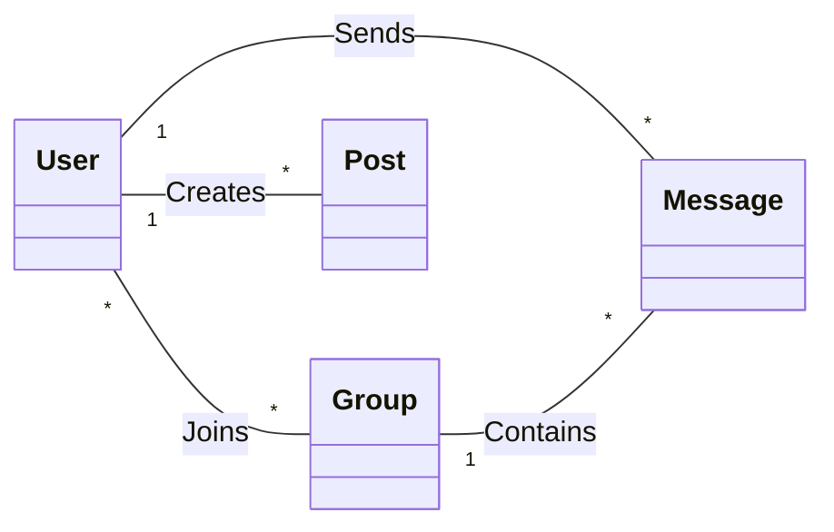

# IMessenger - Final Project Presentation
## 🎓 Connecting ISMAGI Students

---

## 📱 Project Overview

**IMessenger** is a comprehensive, secure, and modern mobile application designed to centralize communication and academic life at ISMAGI. Built on industry standards, it serves as a digital bridge between students, professors, and administration.

---

## 🎯 Project Goals

1. **Strategic Centralization** - Unified hub for all campus communications.
2. **Real-time Collaboration** - Instant messaging for academic and social groups.
3. **Advanced Security** - AES-256 GCM encryption for private communications.
4. **Professional Growth** - Integrated Mini-CVs and skill-based networking.

---

## 🛠️ Advanced Tech Stack

| Component | Technology | Why? |
|-----------|------------|------|
| **Core** | Android (Java) | Robust native performance. |
| **Architecture** | MVVM + Single Activity | Separation of concerns & stability. |
| **Backend** | Firebase (Serverless) | Instant scale & real-time sync. |
| **Security** | AES-256 GCM | Authenticated industrial-grade encryption. |
| **Storage** | Firebase + Room | Hybrid cloud-local cache for speed. |
| **UI** | Material You (M3) | Modern, adaptive, and accessible design. |

---

## ✨ Key Differentiators

### 1. Military-Grade Security
Unlike common messaging apps, IMessenger encrypts every chat message using **AES-256 in GCM mode**, ensuring both confidentiality and data integrity.

### 2. Academic Ecosystem
- **Drive**: Organized document sharing (PDF, PPT).
- **Calendar**: Syncing class schedules and exams in real-time.
- **Mini-CV**: Searchable student directory by skills to find project partners.

### 3. Engineering Quality
Follows Google's modern Android guidelines with **Jetpack components**, ensuring the app is testable, maintainable, and leak-free.

---

## 📊 Business Logic Diagram

---

## 🔐 Security & Reliability

1. **Zero-Leak Policy**: Messages are encrypted locally before reaching the cloud.
2. **Offline-First**: Access previous chats and docs without internet via Room DB.
3. **Safe Environment**: Domain-restricted registration (@ismagi.ma) + Admin moderation.

---

## 🚀 Future Roadmap

- **Intelligent Hub**: AI-driven document categorization.
- **Cross-Platform**: Expansion to iOS using Flutter.
- **Enhanced Tools**: Integrated collaborative project boards and campus maps.

---

## 🎬 Conclusion

IMessenger represents the future of campus connectivity at ISMAGI, combining a professional look with the security and reliability of a enterprise-grade application.

---
*IMessenger - Designed for Engineers, Built for Students.*
