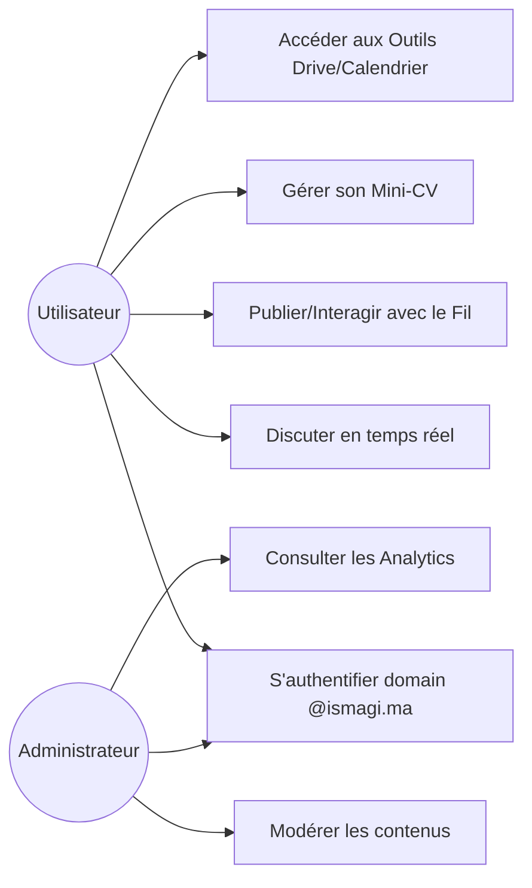
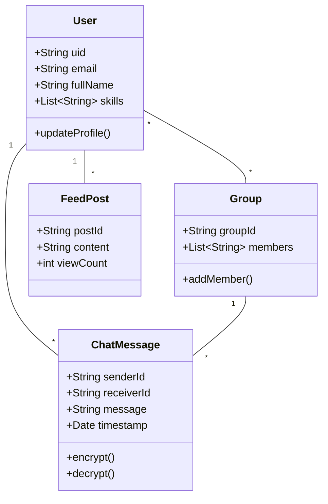

# 🎓 Rapport Pédagogique : IMessenger
## Solution de Communication Centralisée pour l'ISMAGI

---

## 📋 Table des Matières

1. [**Introduction & Contexte Analytique**](#1-introduction--contexte-analytique)
2. [**Objectifs & Vision Stratégique**](#2-objectifs--vision-stratégique)
3. [**Méthodologie de Développement (Agile)**](#3-méthodologie-de-développement-agile)
4. [**Analyse des Besoins & Méthodologie Fonctionnelle**](#4-analyse-des-besoins--méthodologie-fonctionnelle)
5. [**Architecture Logicielle : Approfondissement du Pattern MVVM**](#5-architecture-logicielle--approfondissement-du-pattern-mvvm)
6. [**Architecture Technique & Ecosystème Cloud**](#6-architecture-technique--ecosystème-cloud)
7. [**Conception Métier & Modélisation des Données**](#7-conception-métier--modélisation-des-données)
8. [**Sécurité & Chiffrement (AES-GCM)**](#8-sécurité--chiffrement-aes-gcm)
9. [**Outils & Bibliothèques Tierces**](#9-outils--bibliothèques-tierces)
10. [**Qualité, Tests & Déploiement**](#10-qualité-tests--déploiement)
11. [**Interface Utilisateur (UI/UX) & Design System**](#11-interface-utilisateur-uiux--design-system)
12. [**Conclusion & Perspectives de Développement**](#12-conclusion-&amp;-perspectives-de-développement)

---

## 1. Introduction & Contexte Analytique

Le projet **IMessenger** s'inscrit dans une démarche de transformation digitale des infrastructures académiques. À l'ère de l'hyper-connectivité, les institutions d'enseignement supérieur comme l'**ISMAGI** font face à un défi majeur : la fragmentation de l'information. Les étudiants et le corps professoral utilisent souvent une multitude de plateformes disparates, ce qui entraîne une perte de données et une baisse de l'efficacité collaborative.

Ce projet propose une réponse technique à cette problématique en centralisant tous les flux de communication dans une application mobile unique. L'objectif a été de concevoir une architecture logicielle capable de soutenir une charge utilisateur réelle tout en garantissant une sécurité de niveau industriel.

---

## 2. Objectifs & Vision Stratégique

L'ambition première est d'offrir une expérience utilisateur fluide et sécurisée.
- **Centralisation Stratégique** : Un canal officiel et structuré pour l'école.
- **Continuité Pédagogique** : Faciliter le partage de savoir via le drive intégré.
- **Maîtrise de la Donnée** : Protection par des protocoles de chiffrement robustes.

---

## 3. Méthodologie de Développement (Agile)

Pour mener à bien ce projet sur 3 mois, nous avons adopté la méthodologie **Agile (Scrum)**. Cette approche itérative a permis de s'adapter aux retours utilisateurs et de prioriser les fonctionnalités critiques (MVP - Minimum Viable Product).

- **Sprints** : Cycles de développement de 1 à 2 semaines.
- **Daily Stand-ups** : Réunions quotidiennes pour lever les points de blocage.
- **Backlog Grooming** : Réévaluation constante des priorités (priorité absolue à la messagerie en temps réel).

---

## 4. Analyse des Besoins & Méthodologie Fonctionnelle

L'analyse a identifié trois acteurs clés : **Étudiants**, **Professeurs** et **Administrateurs**. L'un des besoins majeurs identifiés était la distinction entre les annonces officielles et les discussions privées.

### Diagramme de Cas d'Utilisation

---

## 5. Architecture Logicielle : Approfondissement du Pattern MVVM

IMessenger adopte le pattern **MVVM (Model-View-ViewModel)**.

### Justification Théorique
1. **Séparation des Préoccupations** : La vue ne contient aucune logique métier.
2. **Gestion du Cycle de Vie** : Le ViewModel survit aux changements de configuration.
3. **Testabilité** : Logique métier testable indépendamment de l'UI.

---

## 6. Architecture Technique & Ecosystème Cloud

Backend **Serverless** via Firebase.

| Service | Rôle |
|---------|------|
| **Firebase Auth** | Authentification et sécurité via tokens. |
| **Cloud Firestore** | Base NoSQL temps réel et hautement disponible. |
| **Cloud Messaging** | Notifications push pour l'engagement utilisateur. |

---

## 7. Conception Métier & Modélisation des Données

### Diagramme de Classes Métier

---

## 8. Sécurité & Chiffrement (AES-GCM)

Utilisation de **AES-256 GCM**. Ce mode garantit à la fois la **confidentialité** et l'**authenticité** des données transmises, empêchant toute altération malveillante.

---

## 9. Outils & Bibliothèques Tierces

Le développement a été accéléré par l'intégration de bibliothèques standards de l'industrie :

- **Glide** : Gestion optimisée du chargement d'images et mise en cache mémoire/disque.
- **Jetpack Navigation** : Gestion simplifiée des flux de navigation complexes.
- **LiveData & ViewModel** : Composants de cycle de vie pour une UI réactive.
- **Room Persistence** : Abstraction SQLite pour le cache local.

---

## 10. Qualité, Tests & Déploiement

### Stratégie de Qualité
- **Code Reviews** : Analyse systématique du code par les pairs (GitHub Pull Requests).
- **Crashlytics** : Surveillance des crashs en temps réel pour une correction rapide.
- **Performance LeakCanary** : Détection des fuites de mémoire.

### Déploiement
L'application est configurée pour des environnements de "Staging" et "Production" via des fichiers `google-services.json` distincts, permettant de tester les nouvelles fonctionnalités sans affecter les utilisateurs réels.

---

## 11. Interface Utilisateur (UI/UX) & Design System

Utilisation de **Material Design 3**.
- **Responsive Layouts** : Adaptabilité aux smartphones et tablettes.
- **Accessibilité** : Respect des contrastes et support du Dark Mode pour le confort visuel.

---

## 12. Conclusion & Perspectives de Développement

IMessenger démontre qu'une structure rigoureuse alliée à des technologies cloud modernes peut transformer la vie de campus.

**Futur du projet :**
- Intelligence Artificielle pour l'aide aux devoirs.
- Version iOS via Flutter.
- Intégration de paiements pour les événements du club.

---
*Rapport rédigé par un Étudiant en Ingénierie Informatique (4ème Année) - ISMAGI*
